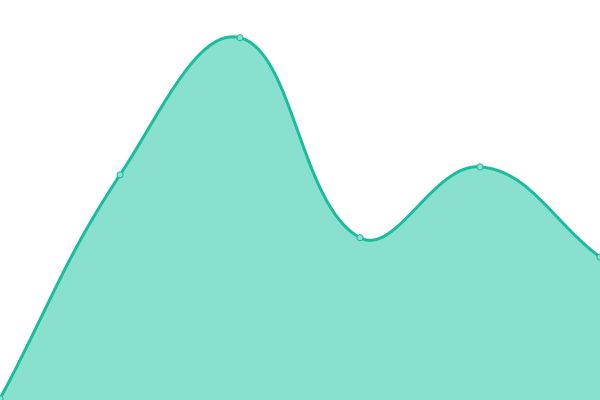
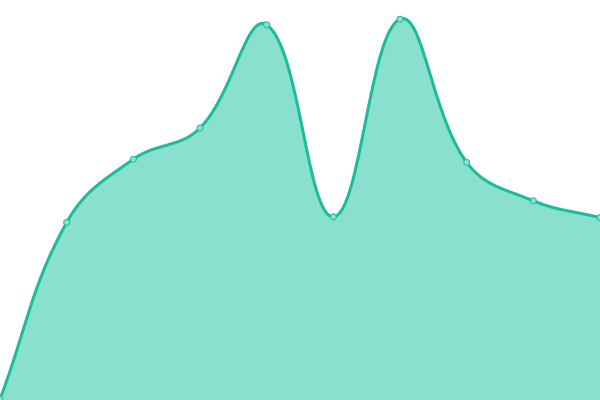

# [📈 Live Status](https://ninpartners.github.io/gu_uptime): <!--live status--> **🟧 Partial outage**

This repository contains the open-source uptime monitor and status page for [ninpartners](https://ninpartners.github.io/gu_uptime), powered by [Upptime](https://github.com/upptime/upptime).

With [Upptime](https://upptime.js.org), you can get your own unlimited and free uptime monitor and status page, powered entirely by a GitHub repository. We use [Issues](https://github.com/ninpartners/gu_uptime/issues) as incident reports, [Actions](https://github.com/ninpartners/gu_uptime/actions) as uptime monitors, and [Pages](https://ninpartners.github.io/gu_uptime) for the status page.

<!--start: status pages-->
<!-- This summary is generated by Upptime (https://github.com/upptime/upptime) -->
<!-- Do not edit this manually, your changes will be overwritten -->
<!-- prettier-ignore -->
| URL | Status | History | Response Time | Uptime |
| --- | ------ | ------- | ------------- | ------ |
|  [GoogleX](https://www.google.com) | 🟩 Up | [google-x.yml](https://github.com/ninpartners/gu_uptime/commits/HEAD/history/google-x.yml) | 

 89ms
     
 | 

<a href="https://ninpartners.github.io/gu_uptime/history/google-x">100.00%</a>
    

|  [Wikipedia](https://en.wikipedia.org) | 🟩 Up | [wikipedia.yml](https://github.com/ninpartners/gu_uptime/commits/HEAD/history/wikipedia.yml) | 

 191ms
     
 | 

<a href="https://ninpartners.github.io/gu_uptime/history/wikipedia">100.00%</a>
    

|  [Hacker News](https://news.ycombinator.com) | 🟩 Up | [hacker-news.yml](https://github.com/ninpartners/gu_uptime/commits/HEAD/history/hacker-news.yml) | 

 312ms
     
 | 

<a href="https://ninpartners.github.io/gu_uptime/history/hacker-news">100.00%</a>
    

|  [Test Broken Site](https://thissitedoesnotexist.koj.co) | 🟥 Down | [test-broken-site.yml](https://github.com/ninpartners/gu_uptime/commits/HEAD/history/test-broken-site.yml) | 

 0ms
     
 | 

<a href="https://ninpartners.github.io/gu_uptime/history/test-broken-site">100.00%</a>
    

|  [MF SITE](780F06107568.sn.mynetname.net) | 🟥 Down | [mf-site.yml](https://github.com/ninpartners/gu_uptime/commits/HEAD/history/mf-site.yml) | 

 0ms
     
 | 

<a href="https://ninpartners.github.io/gu_uptime/history/mf-site">0.03%</a>
    

|  [MF SITE2](https://mf-branch.ninpartners.com) | 🟥 Down | [mf-site-2.yml](https://github.com/ninpartners/gu_uptime/commits/HEAD/history/mf-site-2.yml) | 

 0ms
     
 | 

<a href="https://ninpartners.github.io/gu_uptime/history/mf-site-2">0.28%</a>
    

|  [Google DNS 2xx](mf-fw-01.fortiddns.com) | 🟩 Up | [google-dns-2xx.yml](https://github.com/ninpartners/gu_uptime/commits/HEAD/history/google-dns-2xx.yml) | 

 99ms
     
 | 

<a href="https://ninpartners.github.io/gu_uptime/history/google-dns-2xx">100.00%</a>
    

|  [SITE MF](mf-fw-01.fortiddns.com) | 🟩 Up | [site-mf.yml](https://github.com/ninpartners/gu_uptime/commits/HEAD/history/site-mf.yml) | 

 99ms
     
 | 

<a href="https://ninpartners.github.io/gu_uptime/history/site-mf">100.00%</a>
    

|  [SITE ZO](zo-fw-01.fortiddns.com) | 🟩 Up | [site-zo.yml](https://github.com/ninpartners/gu_uptime/commits/HEAD/history/site-zo.yml) | 

 118ms
     
 | 

<a href="https://ninpartners.github.io/gu_uptime/history/site-zo">100.00%</a>
    

|  [SITE ST](st-fw-01.fortiddns.com) | 🟩 Up | [site-st.yml](https://github.com/ninpartners/gu_uptime/commits/HEAD/history/site-st.yml) | 

 108ms
     
 | 

<a href="https://ninpartners.github.io/gu_uptime/history/site-st">100.00%</a>
    

|  [SITE VC](vc-fw-01.fortiddns.com) | 🟩 Up | [site-vc.yml](https://github.com/ninpartners/gu_uptime/commits/HEAD/history/site-vc.yml) | 

 115ms
     
 | 

<a href="https://ninpartners.github.io/gu_uptime/history/site-vc">100.00%</a>
    

<!--end: status pages-->

[**Visit our status website →**](https://ninpartners.github.io/gu_uptime)

## 📄 License

- Powered by: [Upptime](https://github.com/upptime/upptime)
- Code: [MIT](./LICENSE) © [ninpartners](https://ninpartners.github.io/gu_uptime)
- Data in the `./history` directory: [Open Database License](https://opendatacommons.org/licenses/odbl/1-0/)
